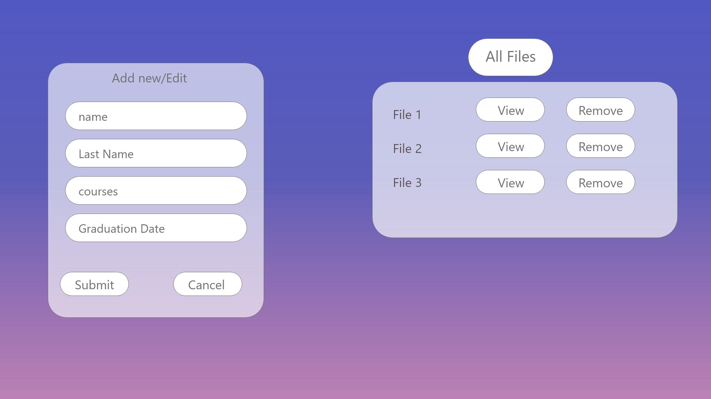

# Development Strategy

> `Courses-Web-App`

This project aims to build server using Express.js framework in the Node.js and interaction with user inputs to store their inputs in the file system. Basically this app works as a CRUD application without database (database is files in this project).

## WIREFRAME

---

## 0. Set-Up

_A User can see the initial repository and live demo_

### Repository

- Created a new repository
- Clone the repository
- Write initial, basic README
- Start the development strategy
- Prepare a project board
- Push the changes to GitHub
- Turn on GitHub Pages

## 1. Save User Info

**As a site visitor, I want to store my info in fs with my name and has a unique number in it .**

This user story has been developed through a branch called 'saveUserInfo'.

> Assign to **Mamé Azad**

### Node.js || Javascript

- Create a post Method for frontend and backend
- Store user info in their unique files
- Refresh the form after submit
- Store all unique IDs

## 2. Get all files

**As a site visitor, I want to see all the saved files .**

This user story has been developed through a branch called 'getAll'.

> Assign to **Gelila**

### Node.js || JavaScript || DOM

- Create a get Method for frontend and backend
- Render all the files on the frontend
- Create 'view' and 'delete' buttons for each file

## 3. Edit User

**As a site visitor, I want be able to edit user information.**

This user story has been developed through a branch called 'edit-user'.

> Assign to **Eltayeb**

### Node.js

- write editUser function
- Write backend handler
- Write a validation middle ware

### Javascript

- Add eventlistener

### HTML

- Add edit button

### JSON

- Add validation schema

## 4. Delete User File

**As a site visitor, I want to delete the file from the list by pushing the button "Delete" .**

This user story has been developed through a branch called 'deleteUI'.

> Assign to **Aleksandra**

### Javascript

- Write a post javascript method to delete the file from the displayed list of all files
- Add to each delete button an unique ID
- Add an eventListener to the delete-button
